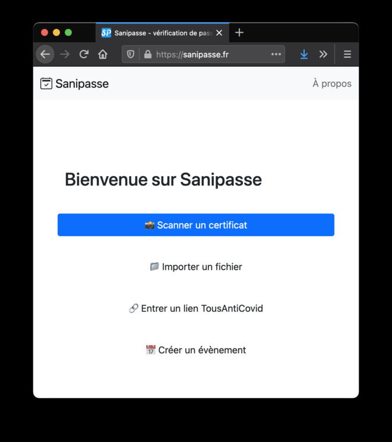
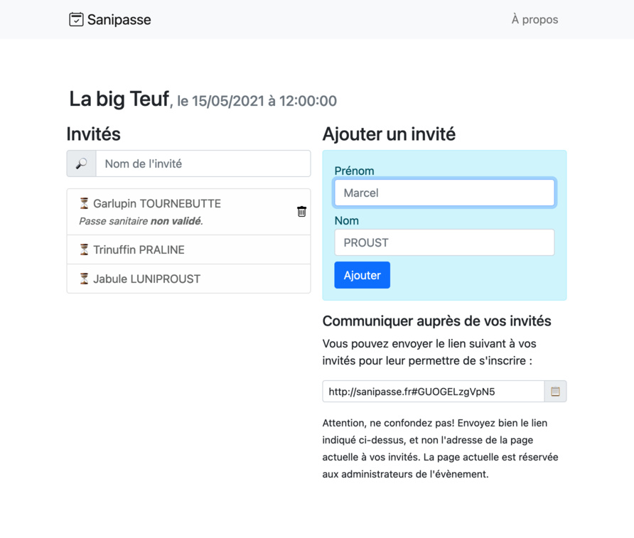
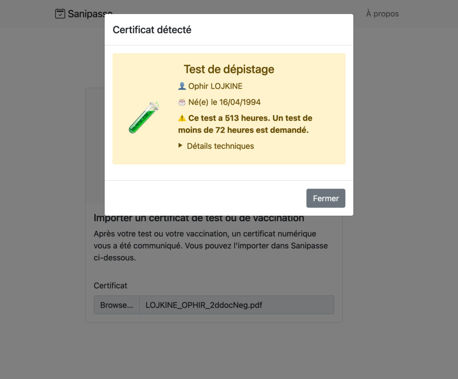

# Sanipasse

Application opensource de vérification de passeport sanitaire et d'organisation d'événements zéro-COVID.

## Screenshots

<table>
    <tr>
    <td>
    <td>
    <td>
</table>

## Developing

Once you've created a project and installed dependencies with `npm install` (or `pnpm install` or `yarn`), start a development server:

```bash
npm run dev

# or start the server and open the app in a new browser tab
npm run dev -- --open
```

## Running

Build the app

```bash
SVELTEKIT_ADAPTER=node npm run build
```

Then run it:

```bash
node build
```
